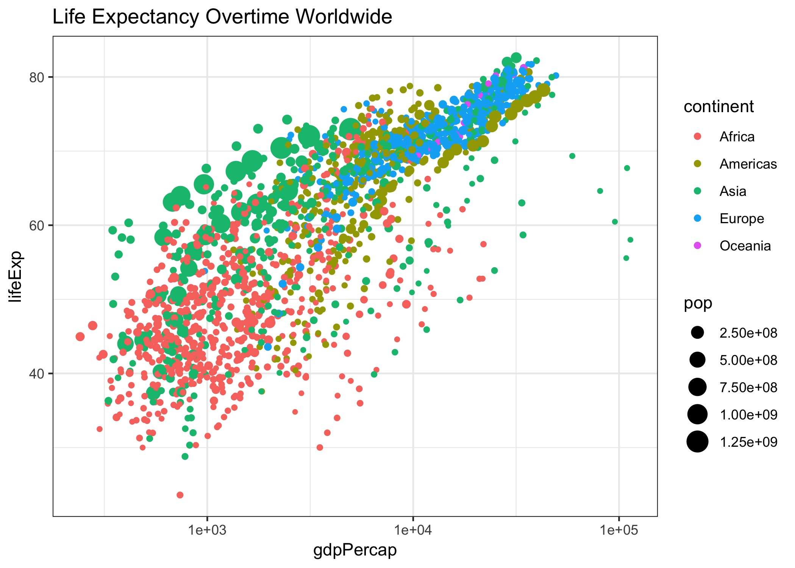
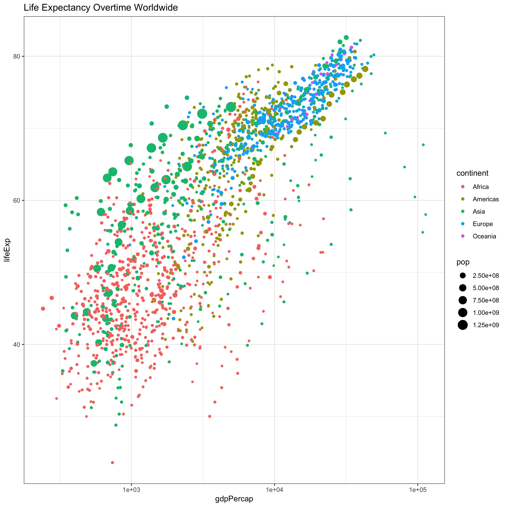

I will use gapminder data set for this assignment
```{r setup, include=FALSE}
knitr::opts_chunk$set(echo = TRUE)
library(gapminder)
suppressPackageStartupMessages(library(tidyverse))
```

## Part 1: Factor management
### Drop Oceania.
First, I will take a look at dataset before dropping Oceania
```{r}
gapminder$continent %>% 
str() ## check the continent structure of orginal data
fct_count(gapminder$continent) %>%  ## count number of records in each level
knitr::kable(col.names=c("continent", "count"))
```

We can see that here are five levels within continent and number of records for each level.

Now let's change it by droping Oceania:

```{r}
no_Oceania=gapminder %>% 
  filter(continent!= "Oceania") %>% ## remove Oceania 
  droplevels()  ## drop unused levels 
no_Oceania %>% 
  str()
```

We can see there are only four levels left in continent now.

Now let's see what exactly being removed

```{r}
gapminder %>% 
  filter(continent=="Oceania") %>% 
  select(country) %>% 
  unique()  ##see how many countries are included in Oceania
```

We can see that there are only two countries included in Oceania. Since it has been removed in 'no_Oceania', we shouldn't see Australia and New Zealand in the new dataset.

```{r}
no_Oceania %>% 
  filter(country %in% c("Australia", "New Zealand"))
```
Here is no records of Australia and New Zealand in this dataset now!

### Reorder the levels of countries using forcats package.

I will check 2007 lifeExp in countries from Americas
```{r}
library(ggplot2)
gapminder %>% 
  filter(year==2007, continent=="Americas") %>%  ## filter to get America 2007 data
  ggplot(aes(lifeExp, country)) + 
  geom_point()+
  ggtitle("2007 Life Expectancy in American")
```

We can see the points are not in certain order, now let's change it by reordering it based on mean life expectancy value

```{r}
gapminder %>% 
  filter(year==2007, continent=="Americas") %>% ## filter to get America 2012 data
  mutate(country=fct_reorder(country, lifeExp, .fun=mean)) %>% 
  ggplot(aes(lifeExp, country)) + 
  geom_point()+
  ggtitle("2007 Life Expectancy in American Reordered by Mean")
```

Now we can see a much more clear and easy interpreted data!

I would also want to try `fct_reorder2()` function, which will order the data based on one factor. I will try it with more simplified data.

```{r}
top5=gapminder %>% 
  filter(country %in% c("Canada","Costa Rica","Puerto Rico","Chili","Cuba")) %>% 
  droplevels() ## select top 5 countries from 2007 Life Expectancy in American reordered by mean

```

Now let's plot this data first.

```{r}
top5 %>% 
  ggplot(aes(year, lifeExp)) +
  geom_line(aes(group=country, color=country)) +
  ggtitle("Highest Life Expectancy over time in Americas")
```

Now let's reorder it according to the life expectancy at very end

```{r}
top5 %>% 
  mutate(country=fct_reorder2(country, year, lifeExp)) %>% 
  ggplot(aes(year, lifeExp)) +
  geom_line(aes(group=country, color=country)) +
  ggtitle("Highest Life Expectancy over time in Americas")
```

Now we can see that the order of Puerto Rico and Cuba changed, as the lastest life expectancy in Puerto Rico is higher than Cuba.


## Part2: File I/O

I would like to explore `write_csv()`/`read_csv()` function. I will use 'top5' data created earlier.

```{r}
# Write csv file
head(top5)
str(top5)
write.csv(top5, file="Top 5 life Expectancy in Americas.csv")

# read it back
top5_read=read.csv("Top 5 life Expectancy in Americas.csv")
head(top5_read)
str(top5_read)
```

One major difference between before writing data in and after reading it back is that new dataset has a new column X which numbered each record.

Now I wish to change the order of this data and keep the ordering when read it back in. I will explore different ordering function see if they could achieve want we want.

```{r}
# fct_reorder()
top5_reorder=top5 %>% 
  arrange(desc(country))## descending the country name
## top5 has been reordered with Cuba and Puerto Rica on the top
top5_reorder
write.csv(top5_reorder, file="top5_reordered.csv")

top5_reorder_read=read.csv("top5_reordered.csv")
top5_reorder_read        
```

We can see that it still preserve the order of the dataset. This is very helpful since we don't need to rearrange the data after we import it.

## Part3 Visualization Design

For this section, I would like to see if there is a better way to visualize life exptancy over time. First, let's plot life expectancy over time and also show population size in each point.

```{r}

p = gapminder %>% 
  ggplot( aes(gdpPercap, lifeExp, size = pop, color = continent)) +
  geom_point() +
  scale_x_log10() +
  ggtitle("Life Expectancy Overtime Worldwide")+
  theme_bw()
p
```

Above graph is good, we can tell some general inforamtion regrading life expectancy on each continent. However, it would be better if we can view it in seperated year. One simple option is to just `facet()` it, but we can do something much greater with `gganimate()`!

```{r}
library(devtools) # load devtools package
devtools::install_github('thomasp85/gganimate',force = TRUE) 
library(gganimate) # laod gganimate package
## in order to create animation like effect, we need to set the frame
gapminder %>% 
  ggplot( aes(gdpPercap, lifeExp, size=pop, color=continent)) +
  geom_point() +
  scale_x_log10() +
  labs(title = 'Year: {frame_time}', x = 'GDP per capita', y = 'life expectancy') +
  theme_bw()+
  # Here is the gganimate specific codes
transition_time(year) # transitions by years
```

Now we can see the trend of life expectancy overtime!

## Part 4: Writing figures to file

For this task, I will use previously created *Life Expectancy Overtime Worldwide* figure:

```{r}
p = gapminder %>% 
  ggplot( aes(gdpPercap, lifeExp, size = pop, color = continent)) +
  geom_point() +
  scale_x_log10() +
  ggtitle("Life Expectancy Overtime Worldwide")+
  theme_bw()
ggsave("Life Expectancy Overtime Worldwide.jpeg")

```

Now, I will load the figure:



We can actually change the width and height of the figure using those arguments in `ggsave()`. For example:

```{r}
ggsave("Life Expectancy Overtime Worldwide_unit.jpeg",width = 25, height = 25, units = "cm")
```



Another function I found very useful is dpi, which allows you to set `dpi` value so that could meet publishing standard.

```{r}
ggsave("Life Expectancy Overtime Worldwide_dpi.jpeg", dpi="print")
```


## But I want to do more

I will pick several countries and asign each one with a stereotypical food. First, let's create such dataset:

```{r}
food_countries=c("China", "Vietnam", "Japan", "Italy", "United States")

gap_food_countries=gapminder %>% 
  filter(country %in% food_countries) %>% 
  droplevels() # drop unused factor levels i.e. the rest of other countries

gap_food_countries$country %>% 
  levels() ## see what levels do we have here
```

Now, I will add a new column containing stereotypical food of each country. I will start wtih `mutate()` function

```{r}
gap_food_countries=gap_food_countries %>% 
  mutate(stereotypicalfood = fct_recode(country, "Dimsum"="China", "Pho"="Vietnam", "Sushi"="Japan", "Spaghetti"="Italy", "Hot Dog"="United States"))

head(gap_food_countries) # Now let's see this new data
tail(gap_food_countries)
gap_food_countries$stereotypicalfood %>% 
  levels() ## Check levels of stereotypicalfood
```

