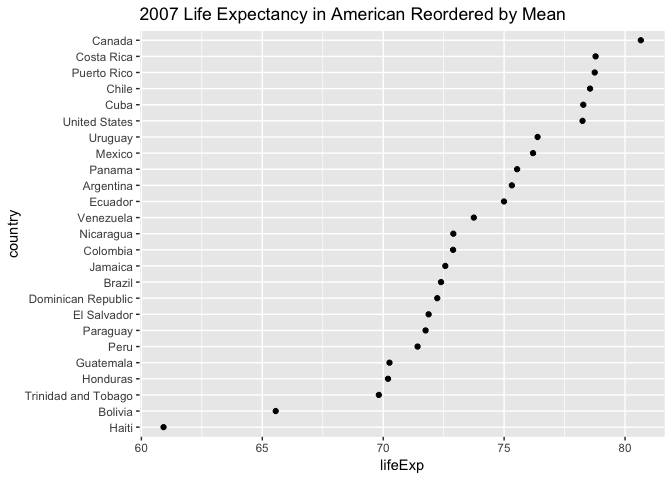

Homework 05: Factor and figure management
================
Jenny
16/10/2018

I will use gapminder data set for this assignment

## Part 1: Factor management

### Drop Oceania.

First, I will take a look at dataset before dropping Oceania

``` r
gapminder$continent %>% 
str() ## check the continent structure of orginal data
```

    ##  Factor w/ 5 levels "Africa","Americas",..: 3 3 3 3 3 3 3 3 3 3 ...

``` r
fct_count(gapminder$continent) %>%  ## count number of records in each level
knitr::kable(col.names=c("continent", "count"))
```

| continent | count |
| :-------- | ----: |
| Africa    |   624 |
| Americas  |   300 |
| Asia      |   396 |
| Europe    |   360 |
| Oceania   |    24 |

We can see that here are five levels within continent and number of
records for each level.

Now let’s change it by droping Oceania:

``` r
no_Oceania=gapminder %>% 
  filter(continent!= "Oceania") %>% ## remove Oceania 
  droplevels()  ## drop unused levels 
no_Oceania %>% 
  str()
```

    ## Classes 'tbl_df', 'tbl' and 'data.frame':    1680 obs. of  6 variables:
    ##  $ country  : Factor w/ 140 levels "Afghanistan",..: 1 1 1 1 1 1 1 1 1 1 ...
    ##  $ continent: Factor w/ 4 levels "Africa","Americas",..: 3 3 3 3 3 3 3 3 3 3 ...
    ##  $ year     : int  1952 1957 1962 1967 1972 1977 1982 1987 1992 1997 ...
    ##  $ lifeExp  : num  28.8 30.3 32 34 36.1 ...
    ##  $ pop      : int  8425333 9240934 10267083 11537966 13079460 14880372 12881816 13867957 16317921 22227415 ...
    ##  $ gdpPercap: num  779 821 853 836 740 ...

We can see there are only four levels left in continent now.

Now let’s see what exactly being removed

``` r
gapminder %>% 
  filter(continent=="Oceania") %>% 
  select(country) %>% 
  unique()  ##see how many countries are included in Oceania
```

    ## # A tibble: 2 x 1
    ##   country    
    ##   <fct>      
    ## 1 Australia  
    ## 2 New Zealand

We can see that there are only two countries included in Oceania. Since
it has been removed in ‘no\_Oceania’, we shouldn’t see Australia and New
Zealand in the new dataset.

``` r
no_Oceania %>% 
  filter(country %in% c("Australia", "New Zealand"))
```

    ## # A tibble: 0 x 6
    ## # ... with 6 variables: country <fct>, continent <fct>, year <int>,
    ## #   lifeExp <dbl>, pop <int>, gdpPercap <dbl>

Here is no records of Australia and New Zealand in this dataset now\!

### Reorder the levels of countries using forcats package.

I will check 2007 lifeExp in countries from Americas

``` r
library(ggplot2)
gapminder %>% 
  filter(year==2007, continent=="Americas") %>%  ## filter to get America 2007 data
  ggplot(aes(lifeExp, country)) + 
  geom_point()+
  ggtitle("2007 Life Expectancy in American")
```

<!-- -->

We can see the points are not in certain order, now let’s change it by
reordering it based on mean life expectancy value

``` r
gapminder %>% 
  filter(year==2007, continent=="Americas") %>% ## filter to get America 2012 data
  mutate(country=fct_reorder(country, lifeExp, .fun=mean)) %>% 
  ggplot(aes(lifeExp, country)) + 
  geom_point()+
  ggtitle("2007 Life Expectancy in American Reordered by Mean")
```

<!-- -->

Now we can see a much more clear and easy interpreted data\!

I would also want to try `fct_reorder2()` function, which will order the
data based on one factor. I will try it with more simplified data.

``` r
top5=gapminder %>% 
  filter(country %in% c("Canada","Costa Rica","Puerto Rico","Chili","Cuba")) %>% 
  droplevels() ## select top 5 countries from 2007 Life Expectancy in American reordered by mean
```

Now let’s plot this data first.

``` r
top5 %>% 
  ggplot(aes(year, lifeExp)) +
  geom_line(aes(group=country, color=country)) +
  ggtitle("Highest Life Expectancy over time in Americas")
```

<!-- -->

Now let’s reorder it according to the life expectancy at very end

``` r
top5 %>% 
  mutate(country=fct_reorder2(country, year, lifeExp)) %>% 
  ggplot(aes(year, lifeExp)) +
  geom_line(aes(group=country, color=country)) +
  ggtitle("Highest Life Expectancy over time in Americas")
```

<!-- -->

Now we can see that the order of Puerto Rico and Cuba changed, as the
lastest life expectancy in Puerto Rico is higher than Cuba.

## Part2: File I/O

I would like to explore `write_csv()`/`read_csv()` function. I will use
‘top5’ data created earlier.

``` r
# Write csv file
head(top5)
```

    ## # A tibble: 6 x 6
    ##   country continent  year lifeExp      pop gdpPercap
    ##   <fct>   <fct>     <int>   <dbl>    <int>     <dbl>
    ## 1 Canada  Americas   1952    68.8 14785584    11367.
    ## 2 Canada  Americas   1957    70.0 17010154    12490.
    ## 3 Canada  Americas   1962    71.3 18985849    13462.
    ## 4 Canada  Americas   1967    72.1 20819767    16077.
    ## 5 Canada  Americas   1972    72.9 22284500    18971.
    ## 6 Canada  Americas   1977    74.2 23796400    22091.

``` r
str(top5)
```

    ## Classes 'tbl_df', 'tbl' and 'data.frame':    48 obs. of  6 variables:
    ##  $ country  : Factor w/ 4 levels "Canada","Costa Rica",..: 1 1 1 1 1 1 1 1 1 1 ...
    ##  $ continent: Factor w/ 1 level "Americas": 1 1 1 1 1 1 1 1 1 1 ...
    ##  $ year     : int  1952 1957 1962 1967 1972 1977 1982 1987 1992 1997 ...
    ##  $ lifeExp  : num  68.8 70 71.3 72.1 72.9 ...
    ##  $ pop      : int  14785584 17010154 18985849 20819767 22284500 23796400 25201900 26549700 28523502 30305843 ...
    ##  $ gdpPercap: num  11367 12490 13462 16077 18971 ...

``` r
write.csv(top5, file="Top 5 life Expectancy in Americas.csv")

# read it back
top5_read=read.csv("Top 5 life Expectancy in Americas.csv")
head(top5_read)
```

    ##   X country continent year lifeExp      pop gdpPercap
    ## 1 1  Canada  Americas 1952   68.75 14785584  11367.16
    ## 2 2  Canada  Americas 1957   69.96 17010154  12489.95
    ## 3 3  Canada  Americas 1962   71.30 18985849  13462.49
    ## 4 4  Canada  Americas 1967   72.13 20819767  16076.59
    ## 5 5  Canada  Americas 1972   72.88 22284500  18970.57
    ## 6 6  Canada  Americas 1977   74.21 23796400  22090.88

``` r
str(top5_read)
```

    ## 'data.frame':    48 obs. of  7 variables:
    ##  $ X        : int  1 2 3 4 5 6 7 8 9 10 ...
    ##  $ country  : Factor w/ 4 levels "Canada","Costa Rica",..: 1 1 1 1 1 1 1 1 1 1 ...
    ##  $ continent: Factor w/ 1 level "Americas": 1 1 1 1 1 1 1 1 1 1 ...
    ##  $ year     : int  1952 1957 1962 1967 1972 1977 1982 1987 1992 1997 ...
    ##  $ lifeExp  : num  68.8 70 71.3 72.1 72.9 ...
    ##  $ pop      : int  14785584 17010154 18985849 20819767 22284500 23796400 25201900 26549700 28523502 30305843 ...
    ##  $ gdpPercap: num  11367 12490 13462 16077 18971 ...

One major difference between before writing data in and after reading it
back is that new dataset has a new column X which numbered each record.

Now I wish to change the order of this data and keep the ordering when
read it back in. I will explore different ordering function see if they
could achieve want we want.

``` r
# fct_reorder()
top5_reorder=top5 %>% 
  arrange(desc(country))## descending the country name
## top5 has been reordered with Cuba and Puerto Rica on the top
top5_reorder
```

    ## # A tibble: 48 x 6
    ##    country     continent  year lifeExp     pop gdpPercap
    ##    <fct>       <fct>     <int>   <dbl>   <int>     <dbl>
    ##  1 Puerto Rico Americas   1952    64.3 2227000     3082.
    ##  2 Puerto Rico Americas   1957    68.5 2260000     3907.
    ##  3 Puerto Rico Americas   1962    69.6 2448046     5108.
    ##  4 Puerto Rico Americas   1967    71.1 2648961     6929.
    ##  5 Puerto Rico Americas   1972    72.2 2847132     9123.
    ##  6 Puerto Rico Americas   1977    73.4 3080828     9771.
    ##  7 Puerto Rico Americas   1982    73.8 3279001    10331.
    ##  8 Puerto Rico Americas   1987    74.6 3444468    12281.
    ##  9 Puerto Rico Americas   1992    73.9 3585176    14642.
    ## 10 Puerto Rico Americas   1997    74.9 3759430    16999.
    ## # ... with 38 more rows

``` r
write.csv(top5_reorder, file="top5_reordered.csv")

top5_reorder_read=read.csv("top5_reordered.csv")
top5_reorder_read        
```

    ##     X     country continent year lifeExp      pop gdpPercap
    ## 1   1 Puerto Rico  Americas 1952  64.280  2227000  3081.960
    ## 2   2 Puerto Rico  Americas 1957  68.540  2260000  3907.156
    ## 3   3 Puerto Rico  Americas 1962  69.620  2448046  5108.345
    ## 4   4 Puerto Rico  Americas 1967  71.100  2648961  6929.278
    ## 5   5 Puerto Rico  Americas 1972  72.160  2847132  9123.042
    ## 6   6 Puerto Rico  Americas 1977  73.440  3080828  9770.525
    ## 7   7 Puerto Rico  Americas 1982  73.750  3279001 10330.989
    ## 8   8 Puerto Rico  Americas 1987  74.630  3444468 12281.342
    ## 9   9 Puerto Rico  Americas 1992  73.911  3585176 14641.587
    ## 10 10 Puerto Rico  Americas 1997  74.917  3759430 16999.433
    ## 11 11 Puerto Rico  Americas 2002  77.778  3859606 18855.606
    ## 12 12 Puerto Rico  Americas 2007  78.746  3942491 19328.709
    ## 13 13        Cuba  Americas 1952  59.421  6007797  5586.539
    ## 14 14        Cuba  Americas 1957  62.325  6640752  6092.174
    ## 15 15        Cuba  Americas 1962  65.246  7254373  5180.756
    ## 16 16        Cuba  Americas 1967  68.290  8139332  5690.268
    ## 17 17        Cuba  Americas 1972  70.723  8831348  5305.445
    ## 18 18        Cuba  Americas 1977  72.649  9537988  6380.495
    ## 19 19        Cuba  Americas 1982  73.717  9789224  7316.918
    ## 20 20        Cuba  Americas 1987  74.174 10239839  7532.925
    ## 21 21        Cuba  Americas 1992  74.414 10723260  5592.844
    ## 22 22        Cuba  Americas 1997  76.151 10983007  5431.990
    ## 23 23        Cuba  Americas 2002  77.158 11226999  6340.647
    ## 24 24        Cuba  Americas 2007  78.273 11416987  8948.103
    ## 25 25  Costa Rica  Americas 1952  57.206   926317  2627.009
    ## 26 26  Costa Rica  Americas 1957  60.026  1112300  2990.011
    ## 27 27  Costa Rica  Americas 1962  62.842  1345187  3460.937
    ## 28 28  Costa Rica  Americas 1967  65.424  1588717  4161.728
    ## 29 29  Costa Rica  Americas 1972  67.849  1834796  5118.147
    ## 30 30  Costa Rica  Americas 1977  70.750  2108457  5926.877
    ## 31 31  Costa Rica  Americas 1982  73.450  2424367  5262.735
    ## 32 32  Costa Rica  Americas 1987  74.752  2799811  5629.915
    ## 33 33  Costa Rica  Americas 1992  75.713  3173216  6160.416
    ## 34 34  Costa Rica  Americas 1997  77.260  3518107  6677.045
    ## 35 35  Costa Rica  Americas 2002  78.123  3834934  7723.447
    ## 36 36  Costa Rica  Americas 2007  78.782  4133884  9645.061
    ## 37 37      Canada  Americas 1952  68.750 14785584 11367.161
    ## 38 38      Canada  Americas 1957  69.960 17010154 12489.950
    ## 39 39      Canada  Americas 1962  71.300 18985849 13462.486
    ## 40 40      Canada  Americas 1967  72.130 20819767 16076.588
    ## 41 41      Canada  Americas 1972  72.880 22284500 18970.571
    ## 42 42      Canada  Americas 1977  74.210 23796400 22090.883
    ## 43 43      Canada  Americas 1982  75.760 25201900 22898.792
    ## 44 44      Canada  Americas 1987  76.860 26549700 26626.515
    ## 45 45      Canada  Americas 1992  77.950 28523502 26342.884
    ## 46 46      Canada  Americas 1997  78.610 30305843 28954.926
    ## 47 47      Canada  Americas 2002  79.770 31902268 33328.965
    ## 48 48      Canada  Americas 2007  80.653 33390141 36319.235

We can see that it still preserve the order of the dataset. This is very
helpful since we don’t need to rearrange the data after we import it.

## Part3 Visualization Design

For this section, I would like to see if there is a better way to
visualize life exptancy over time. First, let’s plot life expectancy
over time and also show population size in each point.

``` r
p = gapminder %>% 
  ggplot( aes(gdpPercap, lifeExp, size = pop, color = continent)) +
  geom_point() +
  scale_x_log10() +
  ggtitle("Life Expectancy Overtime Worldwide")+
  theme_bw()
p
```

<!-- -->

Above graph is good, we can tell some general inforamtion regrading life
expectancy on each continent. However, it would be better if we can view
it in seperated year. One simple option is to just `facet()` it, but we
can do something much greater with `gganimate()`\!

``` r
library(devtools) # load devtools package
devtools::install_github('thomasp85/gganimate',force = TRUE) 
```

    ## Downloading GitHub repo thomasp85/gganimate@master
    ## from URL https://api.github.com/repos/thomasp85/gganimate/zipball/master

    ## Installing gganimate

    ## '/Library/Frameworks/R.framework/Resources/bin/R' --no-site-file  \
    ##   --no-environ --no-save --no-restore --quiet CMD INSTALL  \
    ##   '/private/var/folders/kp/7m5qwjbn55dbqyxq4xcvvz_m0000gp/T/RtmpfSA88D/devtools100447b84b754/thomasp85-gganimate-cc23618'  \
    ##   --library='/Library/Frameworks/R.framework/Versions/3.5/Resources/library'  \
    ##   --install-tests

    ## 

``` r
library(gganimate) # laod gganimate package
## in order to create animation like effect, we need to set the frame
gapminder %>% 
  ggplot( aes(gdpPercap, lifeExp, size=pop, color=continent)) +
  geom_point() +
  scale_x_log10() +
  labs(title = 'Year: {frame_time}', x = 'GDP per capita', y = 'life expectancy') +
  theme_bw()+
  # Here is the gganimate specific codes
transition_time(year) # transitions by years
```

<!-- -->

Now we can see the trend of life expectancy overtime\!

## Part 4: Writing figures to file

For this task, I will use previously created *Life Expectancy Overtime
Worldwide* figure:

``` r
p = gapminder %>% 
  ggplot( aes(gdpPercap, lifeExp, size = pop, color = continent)) +
  geom_point() +
  scale_x_log10() +
  ggtitle("Life Expectancy Overtime Worldwide")+
  theme_bw()
ggsave("Life Expectancy Overtime Worldwide.jpeg")
```

    ## Saving 7 x 5 in image

Now, I will load the figure:


We can actually change the width and height of the figure using those
arguments in `ggsave()`. For
example:

``` r
ggsave("Life Expectancy Overtime Worldwide_unit.jpeg",width = 25, height = 25, units = "cm")
```


Another function I found very useful is dpi, which allows you to set
`dpi` value so that could meet publishing standard.

``` r
ggsave("Life Expectancy Overtime Worldwide_dpi.jpeg", dpi="print")
```

    ## Saving 7 x 5 in image


## But I want to do more

I will pick several countries and asign each one with a stereotypical
food. First, let’s create such dataset:

``` r
food_countries=c("China", "Vietnam", "Japan", "Italy", "United States")

gap_food_countries=gapminder %>% 
  filter(country %in% food_countries) %>% 
  droplevels() # drop unused factor levels i.e. the rest of other countries

gap_food_countries$country %>% 
  levels() ## see what levels do we have here
```

    ## [1] "China"         "Italy"         "Japan"         "United States"
    ## [5] "Vietnam"

Now, I will add a new column containing stereotypical food of each
country. I will start wtih `mutate()` function

``` r
gap_food_countries=gap_food_countries %>% 
  mutate(stereotypicalfood = fct_recode(country, "Dimsum"="China", "Pho"="Vietnam", "Sushi"="Japan", "Spaghetti"="Italy", "Hot Dog"="United States"))

head(gap_food_countries) # Now let's see this new data
```

    ## # A tibble: 6 x 7
    ##   country continent  year lifeExp       pop gdpPercap stereotypicalfood
    ##   <fct>   <fct>     <int>   <dbl>     <int>     <dbl> <fct>            
    ## 1 China   Asia       1952    44   556263527      400. Dimsum           
    ## 2 China   Asia       1957    50.5 637408000      576. Dimsum           
    ## 3 China   Asia       1962    44.5 665770000      488. Dimsum           
    ## 4 China   Asia       1967    58.4 754550000      613. Dimsum           
    ## 5 China   Asia       1972    63.1 862030000      677. Dimsum           
    ## 6 China   Asia       1977    64.0 943455000      741. Dimsum

``` r
tail(gap_food_countries)
```

    ## # A tibble: 6 x 7
    ##   country continent  year lifeExp      pop gdpPercap stereotypicalfood
    ##   <fct>   <fct>     <int>   <dbl>    <int>     <dbl> <fct>            
    ## 1 Vietnam Asia       1982    58.8 56142181      707. Pho              
    ## 2 Vietnam Asia       1987    62.8 62826491      821. Pho              
    ## 3 Vietnam Asia       1992    67.7 69940728      989. Pho              
    ## 4 Vietnam Asia       1997    70.7 76048996     1386. Pho              
    ## 5 Vietnam Asia       2002    73.0 80908147     1764. Pho              
    ## 6 Vietnam Asia       2007    74.2 85262356     2442. Pho

``` r
gap_food_countries$stereotypicalfood %>% 
  levels() ## Check levels of stereotypicalfood
```

    ## [1] "Dimsum"    "Spaghetti" "Sushi"     "Hot Dog"   "Pho"
